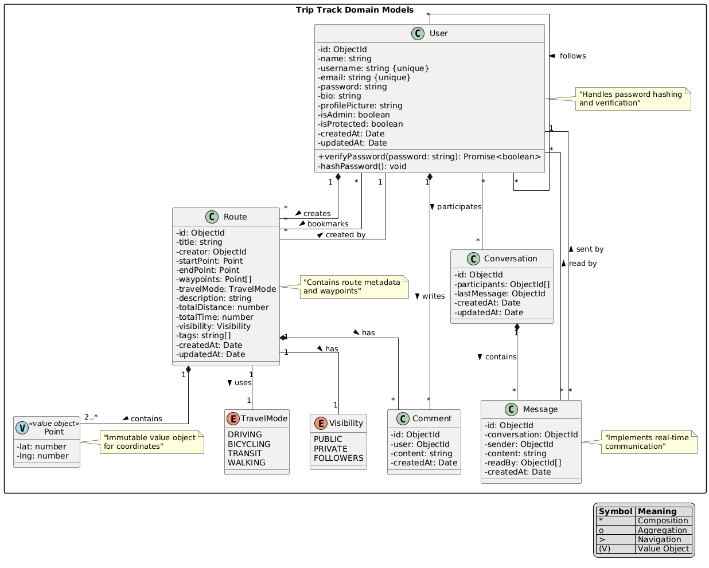

# Trip Track

Trip Track is a full-stack web application that allows users to create, share, and discover travel routes. Users can plan their journeys using interactive maps, share their routes with others, and engage with the community through comments and likes.

## 🚀 Tech Stack

### Frontend

- **React 18** with **TypeScript**
- **Vite** for build tooling
- **TanStack Query** for data fetching
- **Tailwind CSS** with **shadcn/ui** components
- **Google Maps API** (@vis.gl/react-google-maps)
- **Zustand** for state management
- **React Router** for navigation
- **React Hook Form** with **Zod** validation

### Backend

- **Node.js** with **Express**
- **TypeScript**
- **MongoDB** with **Mongoose**
- **Jest** for testing
- **Express Session** for authentication
- **Express Validator** for request validation

## 🏗️ Architecture

The project follows a modern client-server architecture with a clear separation of concerns:



### Domain Models

- **Users** with authentication and social features
- **Routes** with waypoints and travel modes
- **Comments** and messaging system
- **Real-time updates** for messages

## 🚦 Getting Started

### Prerequisites

- **Node.js** (v20.18.0 or higher)
- **MongoDB**
- **npm** or **yarn**
- **Docker** (optional)

### Environment Setup

1. **Clone the repository:**

   ```bash
   git clone https://github.com/babaygt/trip-track-social.git
   cd trip-track
   ```

2. **Install dependencies:**

   - **Frontend:**

     ```bash
     cd frontend
     npm install
     ```

   - **Backend:**

     ```bash
     cd ../backend
     npm install
     ```

3. **Configure Environment Variables:**

   - **Frontend:**

     Create a `.env` file in the `frontend` directory and add the following variables:

     ```env
     VITE_API_URL=http://localhost:3000/api
     VITE_GOOGLE_MAPS_API_KEY=your_google_maps_api_key
     ```

   - **Backend:**

     Create a `.env` file in the `backend` directory and add the following variables:

     ```env
     PORT=3000
     MONGODB_URI=mongodb://localhost:27017/triptrack
     SESSION_SECRET=your_session_secret
     ```

4. **Run the Application:**

   - **Using npm:**

     - **Frontend:**

       ```bash
       cd frontend
       npm run dev
       ```

     - **Backend:**

       ```bash
       cd ../backend
       npm run start
       ```

   - **Using Docker (Optional):**

     Ensure you have Docker installed and run:

     ```bash
     docker-compose up --build
     ```

     This will set up both frontend and backend services along with MongoDB.

5. **Access the Application:**

   Open your browser and navigate to `http://localhost:5173` to access the frontend and `http://localhost:3000` for the backend API.

## 🧪 Running Tests

- **Backend Tests:**

  ```bash
  cd backend
  npm run test
  ```

## 📚 Documentation

### API Endpoints

Detailed documentation of the API endpoints can be found [here](docs/API_Documentation.md).

### Data Documentation

Detailed documentation of the data models can be found [here](docs/DATA_DOCUMENTATION.md).

### Component Library

The frontend utilizes **shadcn/ui** components. Refer to the [component library documentation](https://ui.shadcn.com/) for more details.

## 🌟 Features

- **User Authentication:**

  - Sign up, login, and logout functionalities.
  - Protected routes to ensure secure access.

- **Route Management:**

  - Create, edit, and delete travel routes.
  - Add waypoints with different travel modes.
  - Set visibility levels for routes.

- **Social Interaction:**

  - Comment on routes.
  - Like and bookmark favorite routes.
  - Real-time messaging between users.

- **Interactive Maps:**
  - Plan journeys using Google Maps integration.
  - Visualize routes with waypoints and travel paths.

## 🛠️ Contributing

Contributions are welcome! Please follow these steps:

1. **Fork the repository.**

2. **Create a new branch:**

   ```bash
   git checkout -b feature/YourFeature
   ```

3. **Make your changes and commit them:**

   ```bash
   git commit -m "Add some feature"
   ```

4. **Push to the branch:**

   ```bash
   git push origin feature/YourFeature
   ```

5. **Open a Pull Request.**

## 📝 License

This project is licensed under the [MIT License](LICENSE).

## 📧 Contact

For any inquiries or feedback, please contact [yigitbaba.contact@gmail.com](mailto:yigitbaba.contact@gmail.com).
