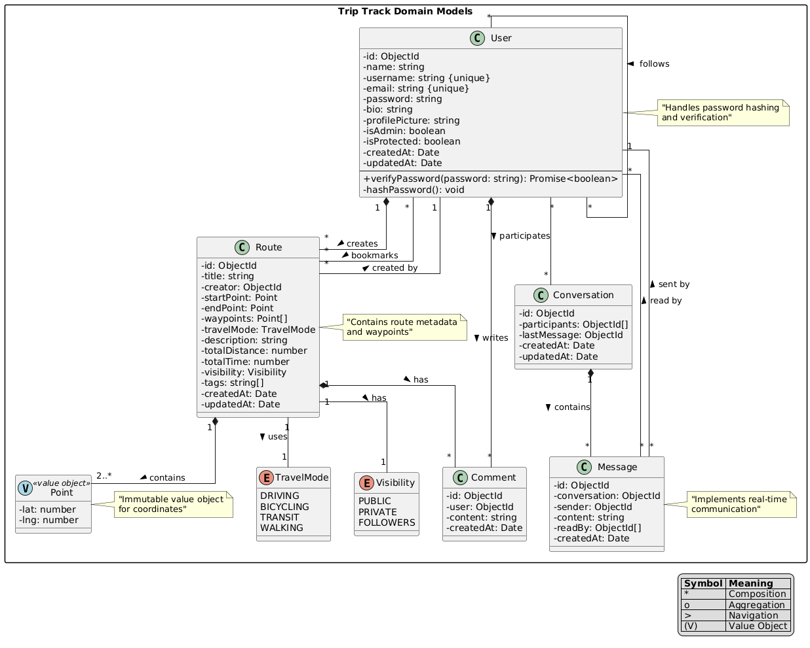
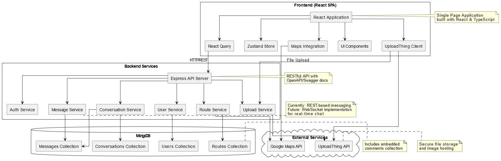

# Trip Track Architecture

## System Overview

Trip Track is built using a modern client-server architecture that emphasizes scalability, maintainability, and real-time capabilities. This document outlines the key architectural decisions and system components.

## Architecture Diagrams

The system architecture is documented through two complementary diagrams:

1. **Domain Model**: Shows the core domain entities and their relationships



2. **System Architecture**: Illustrates the main system components and their interactions



## Core Components

### Frontend Architecture

The frontend is a Single Page Application (SPA) built with modern web technologies:

- **Framework**: React with TypeScript for type safety
- **State Management**:
  - Zustand for global application state
  - React Query for server state and caching
- **UI Layer**:
  - Shadcn/ui components for consistent design
  - Tailwind CSS for styling
  - Responsive design for mobile support
- **Maps**: Google Maps API for route visualization
- **File Upload**: UploadThing client for image uploads

### Backend Architecture

The backend follows a layered architecture pattern:

- **API Layer**:
  - Express.js with TypeScript
  - RESTful endpoints for all services
  - OpenAPI/Swagger documentation
  - Session-based authentication
- **Service Layer**:
  - Auth Service: User authentication and session management
  - User Service: User profile and social features
  - Route Service: Route creation and management
  - Message Service: Messaging functionality
  - Conversation Service: Chat conversation handling
  - Upload Service: File upload management
- **Data Layer**:
  - MongoDB with Mongoose ODM
  - Collections:
    - Users: User profiles and relationships
    - Routes: Routes with embedded comments
    - Messages: Chat messages
    - Conversations: Chat conversations
  - Optimized indexes for performance

### External Services Integration

The system integrates with several external services:

- **Google Maps Platform**:
  - Route visualization and planning
  - Geocoding and address lookup
  - Distance calculations
- **UploadThing**:
  - Secure image storage
  - CDN delivery
  - Image optimization
  - Upload progress tracking
  - Direct-to-storage uploads

## Data Flow

### Authentication Flow

1. User submits credentials
2. Server validates and creates session
3. Session ID stored in secure cookie
4. Subsequent requests include session cookie
5. Auth middleware validates session

### Route Creation Flow

1. User creates route on map interface
2. Frontend validates and formats data
3. API request with route data
4. Server validates and stores route
5. Comments stored as embedded documents

### Chat System Flow (Current Implementation)

1. Client creates or loads conversation
2. Messages sent via REST API
3. Messages stored in dedicated collection
4. Client polls for new messages
5. Messages marked as read via API

### Image Upload Flow

1. User selects image for upload
2. Frontend initiates upload request
3. UploadThing client handles direct upload
4. Backend receives upload completion webhook
5. File metadata stored in database
6. CDN URL returned to frontend

## Security Considerations

- **Authentication**:
  - Session-based authentication
  - Secure password hashing
  - Rate limiting on auth endpoints

## Performance Optimizations

- **Frontend**:
  - React Query caching
  - Code splitting
  - Asset optimization
  - Lazy loading
- **Backend**:
  - MongoDB indexes
  - Query optimization

## API Documentation

### Swagger/OpenAPI Integration

The API is documented using OpenAPI 3.0 specification through Swagger. The documentation is automatically generated from code annotations and is accessible at `/api-docs` endpoint.

### Documentation Structure

1. **Components**

   - **Schemas**: Data models (User, Route, Message, etc.)
   - **Security Schemes**: Session-based authentication
   - **Tags**: Logical grouping of endpoints

2. **Endpoint Groups**

   - Auth: Authentication endpoints
   - Users: User management
   - Routes: Route creation and management
   - Messages: Messaging system
   - Conversations: Chat management

3. **Common Patterns**
   ```typescript
   /**
    * @swagger
    * /endpoint:
    *   post:
    *     tags: [Category]
    *     summary: Brief description
    *     security:
    *       - sessionAuth: []
    *     requestBody:
    *       required: true
    *       content:
    *         application/json:
    *           schema:
    *             $ref: '#/components/schemas/Model'
    *     responses:
    *       200:
    *         description: Success response
    *       400:
    *         description: Error response
    */
   ```

### Authentication

All protected endpoints use session-based authentication:

```typescript
securitySchemes: {
  sessionAuth: {
    type: 'apiKey',
    in: 'cookie',
    name: 'connect.sid'
  }
}
```

### Response Standards

1. **Success Responses**

   - 200: Successful operation
   - 201: Resource created
   - 204: No content (successful deletion)

2. **Error Responses**
   - 400: Bad request
   - 401: Unauthorized
   - 403: Forbidden
   - 404: Not found
   - 500: Server error

### Pagination Pattern

```typescript
{
  data: T[],
  total: number,
  page: number,
  pages: number,
  limit: number
}
```

### Documentation Guidelines

1. **Route Documentation**

   - Clear summary and description
   - All parameters documented
   - Request/response schemas referenced
   - Authentication requirements specified
   - Example responses included

2. **Schema Documentation**

   - All properties described
   - Required fields marked
   - Validation rules included
   - Relationships documented

3. **Maintenance**
   - Update documentation with code changes
   - Test documentation accuracy
   - Keep examples up to date
   - Version significant changes

## Implementation Roadmap

### Phase 1 (Current)

- REST-based API implementation
- Basic messaging functionality
- Route creation and sharing
- Image upload integration
- Session-based authentication

### Phase 2 (Planned)

- WebSocket integration for real-time chat
- Push notifications
- Message delivery status
- Typing indicators
- Presence detection

### Phase 3 (Future)

- Voice messages
- Group conversations
- Message reactions
- Rich media previews
